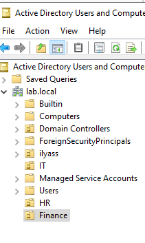
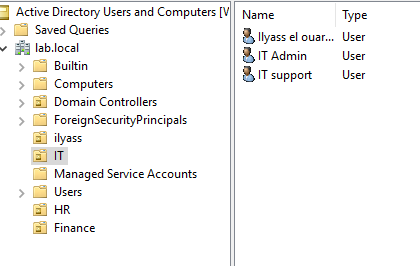
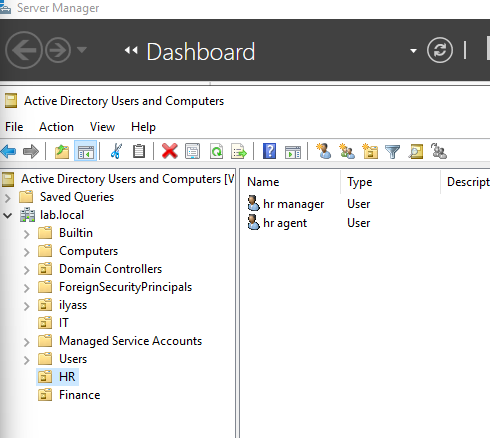
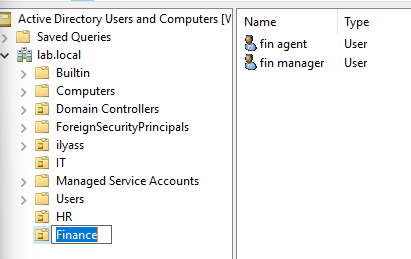
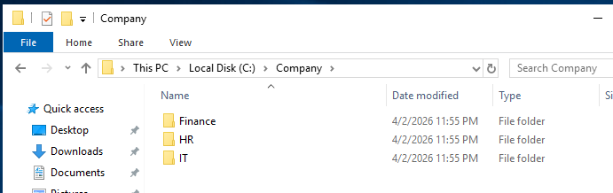
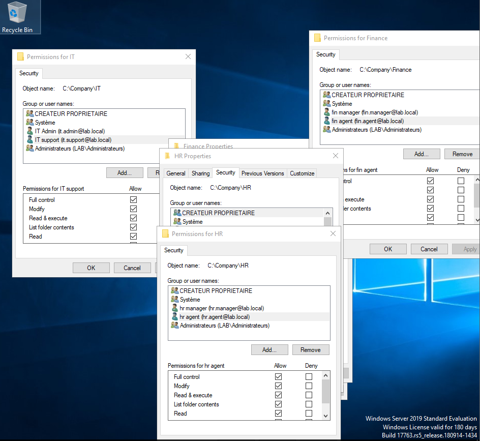
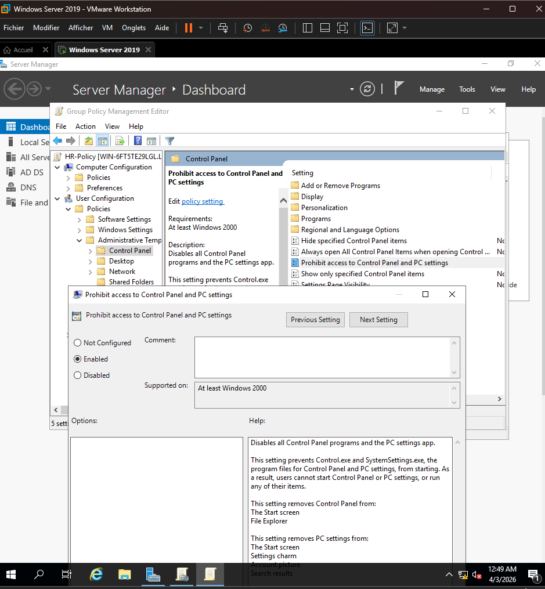
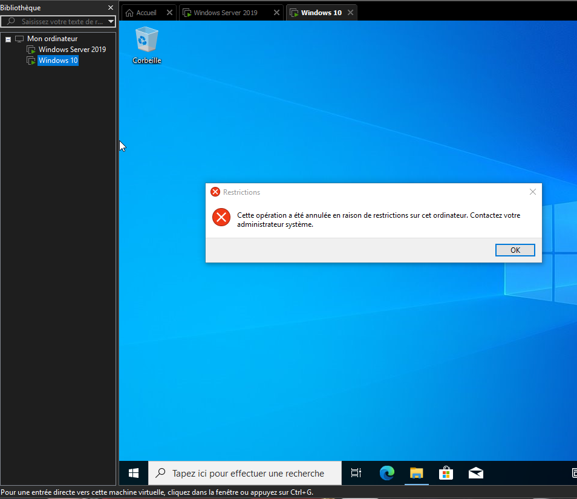
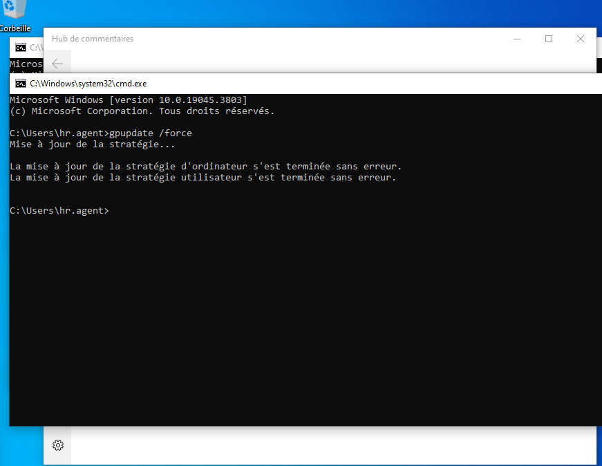
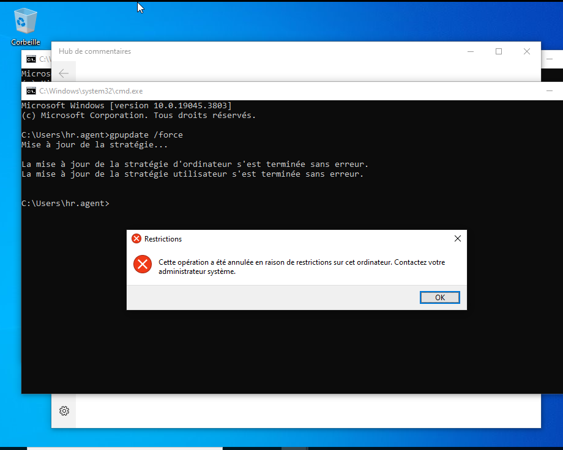

# 🏢 Enterprise Active Directory Lab

## 📌 Project Overview

This project simulates a real enterprise IT environment using Active Directory, File Server, and Group Policy.

---

## 🧱 Lab Architecture

* Domain Controller: Windows Server
* Client Machine: Windows 10
* Network: Host-only

---

## ⚙️ Technologies Used

* VMware Workstation
* Windows Server
* Windows 10
* Active Directory
* Group Policy (GPO)
* NTFS Permissions

---

# 🔹 Part 1: Active Directory Structure

## 🏢 Organizational Units

### 🖥️ Screen 1: Create Organizational Units

This step shows creating Organizational Units (OUs) to organize departments in the enterprise environment (IT, HR, Finance).

### 🖥️ Screen 2: Create Users

This step shows creating users within each Organizational Unit to represent employees in different departments.

#### IT Department

#### HR Department

#### Finance Department

# 🔹 Part 2: File Server

## 📂 Folder Structure

### 🖥️ Screen 3: Create Company Folder

This step shows creating the main company folder structure with separate directories for each department (IT, HR, Finance).

---

### 🖥️ Screen 4: Configure Permissions

This step shows configuring NTFS permissions to restrict access so that each department can only access its own folder (IT, HR, Finance).

# 🔹 Part 3: Group Policy (GPO)

### 🖥️ Screen 5: Create and Configure GPO

This step shows creating and configuring a Group Policy Object (GPO) to restrict user access to the Control Panel.

## 🧪 Part 6: Testing

### 🖥️ Screen 6.1: GPO Restrictions Applied
This screenshot shows that Group Policy is successfully applied.  
Access to Control Panel is blocked.

---

### 🖥️ Screen 6.2: Policy Update and Network Test
This screenshot shows successful policy update and network connectivity.

---

### 🖥️ Screen 6.3: Domain User Login
This screenshot shows successful login using a domain user.

---

# ✅ Conclusion

This project demonstrates enterprise-level Active Directory configuration including security, file sharing, and policy management.
